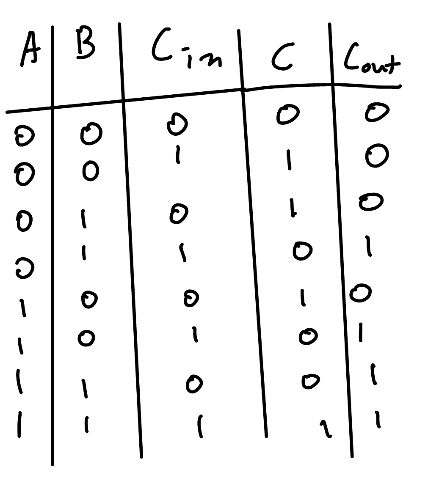
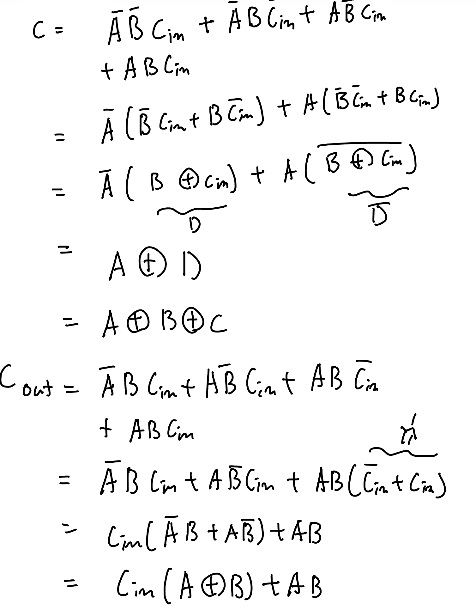
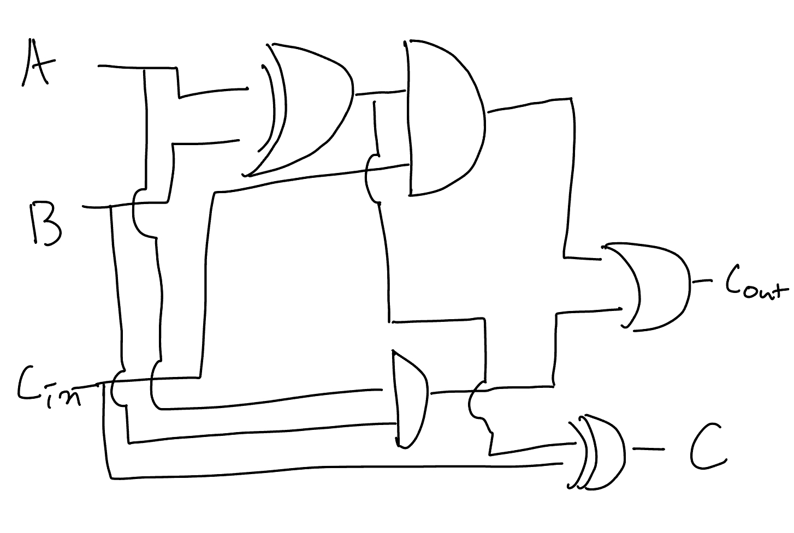

# Lab 2: 

# Overview and Motivation
Welcome to the Lab 02 of CS281: Introduction to Computer Systems! 
This lab will help you get more familiar with mux and logic circuits. The lab will take you through the intricacies of the 74150 mux chip and different gates (And, Or, Not). By the end of this lab, you'll be adept at working with essential circuit components.


# Objectives of the Lab
1. Familiarize yourself with the mux chip and learn to control it.
2. Understand and construct an Adder by using circuit chips.
3. Develop the ability to read and interpret IC data sheets.
4. Gain hands-on experience in controlling circuits with the Arduino.
 
# Materials
- PB-503 breadbofard prototyping station (integrated device with a number of electrical components like switches)
- Arduino kit
- 7404 NOT gate IC
- 7408 AND gate IC
- OR gate IC
- 74150 mux chip
- Wires
- LED
- Arduino controller and USB cable


https://github.com/mlcourses/lab-2-blog-post-group2_cs281/assets/108073642/125a3946-ed96-45de-8bef-ba428378e4da


https://github.com/mlcourses/lab-2-blog-post-group2_cs281/assets/108073642/213d9fcb-be48-41ab-842a-1e43fefb773a


https://github.com/mlcourses/lab-2-blog-post-group2_cs281/assets/108073642/ddfe7483-52f7-43e0-9fa7-299b150f3bff


https://github.com/mlcourses/lab-2-blog-post-group2_cs281/assets/108073642/5a70cc00-38b9-4871-86ad-b185ff36a86f


https://github.com/mlcourses/lab-2-blog-post-group2_cs281/assets/108073642/a8c8027f-aae0-4918-9dca-6aa916d5edb1


https://github.com/mlcourses/lab-2-blog-post-group2_cs281/assets/108073642/4e63c027-e4d0-484e-8188-e232cd5fff7f


# A 2 to 1 Mux
## 0 About

## 1. Project Step


## 2. Testing


# A 4 to 1 Mux
## 0 About

## 1. Project Step


## 2. Testing


# A 4 to 1 Mux with Arduino
## 0 About
We will be using an Arduino to test the operation of the 4-1 Multiplexer in this portion of the lab.
Previously, we used switches to test the ourputs and operations for the mux, but by using an Arduino, we can automate the process. 
For this section, we will provide our program we used for our Arduino and explain them as we go. 
Takeaways from this section include: How to use an Arduino with a circuit, how to program an Arduino board, continuation of using a 4-1 Multiplexer.
## 1. Project Step
To start off, we want to write up the code we will use in the Arduino program. You can simply copy this code here:
```
const int S0[] = {0,0,1,1,0,0,1,1};
const int S1[] = {0,0,0,0,1,1,1,1};
const int A[] = {0,1,0,0,0,0,0,0};
const int B[] = {0,0,0,1,0,0,0,0};
const int C[] = {0,0,0,0,0,1,0,0};
const int D[] = {0,0,0,0,0,0,0,1};
const int Y[] = {0,1,0,1,0,1,0,1};
// You are probably using a 74150, so the outputs are reversed.
// Use this Y instead:
// const int Y[] = {1,0,1,0,1,0,1,0};
const int WAIT0 = 300;
const int WAIT1 = 2000;
int index = 0;
int x; // for reading input
void setup() {
    // Serial Port setup for communication back to computer
    Serial.begin(9600);
    // data pins are outputs (for Arduino)
    pinMode(10,OUTPUT); // A
    pinMode(11,OUTPUT); // B
    pinMode(12,OUTPUT); // C
    pinMode(13,OUTPUT); // D
    // select pins are outputs (for Arduino)
    pinMode(8,OUTPUT); // S0
    3
    pinMode(9,OUTPUT); // S1
    // Mux output is input for Arduino
    pinMode(7,INPUT);
}
void loop() {
    // write data inputs to MUX
    digitalWrite(10,A[index]);
    digitalWrite(11,B[index]);
    digitalWrite(12,C[index]);
    digitalWrite(13,D[index]);
    // write select line inputs to MUX
    digitalWrite(8,S0[index]);
    digitalWrite(9,S1[index]);
    delay(WAIT0); // give time for logic signal to propagate
    // read the MUX output
    x = digitalRead(7);
    // display the results
    Serial.print(index);
    Serial.print(" x:");
    Serial.print(x,BIN);
    Serial.print(", y:");
    Serial.print(Y[index],BIN);
    Serial.print("\t ");
    if ( x == Y[index] )
    {
        Serial.print(": OK\n");
    }
    else
    {
        Serial.print(": BAD\n");
    }
    delay(WAIT1);
    index = (index+1) % 8; // increment index
}
```
For consistency with the program, stick to these inputs for the Arduino:
<br>Pin 10 Data input A (E0 on the mux)
<br>Pin 11 Data input B (E1 on the mux) 
<br>Pin 12 Data input C (E2 on the mux) 
<br>Pin 13 Data input D (E3 on the mux) 
<br>Pin 8 Select Line 0 (A on the mux) 
<br>Pin 9 Select Line 1 (B on the mux) 
<br>Pin 7 output data from mux (w on the mux) 
<br>GND Connect the GND (adjacent to pin 13) to ground on the breadboard 
### Wiring
Here is an IC Diagram for the 4-1 Mux to help understand the wiring
<br>
- Looking at this diagram, it may look very confusing. No need to worry, we will explain the wiring.
- Starting off you will want to make sure that the mux has power by wiring pin 24 into power on the breadboard.
- Next we will add our ground wires to be attached adjacent to pin hole 13 on the board, as well as 12, 11, and 9.
- Next, lets do our selector pins. We used orange wires to indicate these, but you make pick whatever color you would like. These will go into ports A and B on the mux. (You can refer to the pin inputs previosuly mentioned to see which wire goes to which port on the Arduino).
- Next we will want to add our input wires, do this by inserting wires adjacent to pins E0-E3. These will by attached to pins 10-13 on the Arduino. (Again, refer to the pin inputs for the Arduino previously stated).
- Finally for the mux, we want to wire our output to the logic indicator. This can be done by inserting a wire adjacent to the W pin on the mux.
- For the Arduino we also need to ground it (GND on the board), as well as connect all the wires from the mux to the appropriate pin holes.
## 2. Testing
It is now time to use the code to test our 4-1 Multiplexer! First lets understand the code.
- The first two lines are lists containing 0s and 1s for our selector pins. You will see a lot of these lists. The program will loop through these lists and use the values at each index of the list as an input to the mux.
- The next 4 lines (lists A-D), are the data inputs for the mux
- Next is the output list (list Y). There is a note in the code for a list if you are using a 74150 Mux, which we were using in this case. If this is the case for you as well, uncomment the code.
- After that there are two lines making variables that we will use as time delays.
- Next, we create variables index and x. Index is used to indicate which index of the lists we are on for data input. "x" is used for reading input.
- In the setup function of the code, we are assining the pins to their appropriate pinholes on the arduino and that they will be output.
- Now we are in the void loop. We are starting by assigning the values at the current index of the lists for each pin (currently index is 0). We are also doing this for the selector pins.
- Next we do a delay for the logic signal to propogate.
- Then we are assigning the output from the mux to "x"
- Finally the last chunk of code is displaying information regarding the inputs.

<br>Now that we understand the code we can test our circuit and make sure it works.
- Make sure to compile and verify the code and then upload it to the Arduino.
- It should then start running on your computer screen.
- You will see lines indicating the inputs and they will either say "Ok" or "Bad"
- You want to make sure they all say "Ok"!
- Here is what our correct wiring looks like if yours is not working:
<br>
# Adder Circuit
## 0 About
<br>
We will generate a binary adder in this section! 
The adder has a couple of inputs: namely bits Ai + Bi of the two operands.
The outputs are the carry-over from the previous sum and sum bit. 
We will use cin be the carry-in bit from a previous column. Let cout be the carry-out bit which may go through to the next column.
This will be very important in building complex arithmetic circuits later.
Now let's start!

 
## 1. Project Step
- Design a circuit that takes two 1-bit numbers as inputs, plus a carry-in and outputs (first - a bit representing the 1-bit sum of the numbers and second - a bit representing the 1-bit carry)
  1. Build a truth table (tree inputs and two output columns)
     <br>
  2. Create SOP design for two outputs (try to reduce the complexity if you can)
     <br>
  3. Design a circuit for the adder
      <br>
- Check the circuit is working by using a computer program
- Build the circuit on the breadboard (circuits we are using are AND, XOR, and OR gates IC chips)
- Start testing!


## 2. Testing
- Use three switches for the inputs that you connected
- Try to implement the truth table and check the outputs match
#### Note : Green LED = Cout and Red LED = C


### Example tests:
1. A = 0, B = 0, Cin = 0  => C = 0, Cout = 0 
<br>

2. A = 0, B = 0, Cin = 1  => C = 1, Cout = 0 
<br>

3. A = 1, B = 0, Cin = 0  => C = 1, Cout = 0
<br>

4. A = 1, B = 0, Cin = 1  => C = 0, Cout = 1
<br>

5. A = 1, B = 1, Cin = 1  => C = 1, Cout = 1
<br>

# Conclusion
This lab had a lot of key takeaways. Namely, we reinforced our understanding of AND, OR, and NOT gates, and even began using an XOR gate for the first time on a breadboard. Along with the XOR gate, some new things we used were, 2-1 and 4-1 multiplexers. While it was easy to just use a premade mux, it is crucial to understand the operations of a mux. It may be helpful to draw out how a mux makes decisions and even try wiring it yourself. Along with a mux, we were also introduced to an adder. Building and understanding these was important in the furthering of our knowledge of logic circuits.


